# AI Shell Desktop

An open-source Windows / macOS desktop client for [DeepSeek Harness](https://github.com/deepseek-ai/deepseek-harness): terminals, files, and an AI conversation in one window — the AI works only in the real terminals you opened.

> An independent community project. It is not affiliated with, partnered with, authorized by, or endorsed by DeepSeek.

## Screenshots


### Start a session, reach a host

| New session | Hosts panel |
| --- | --- |
| 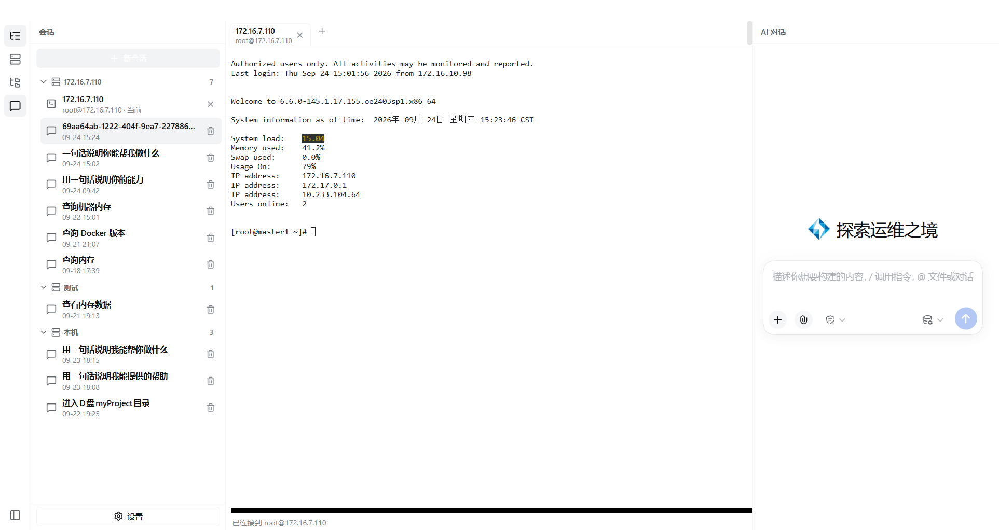 | 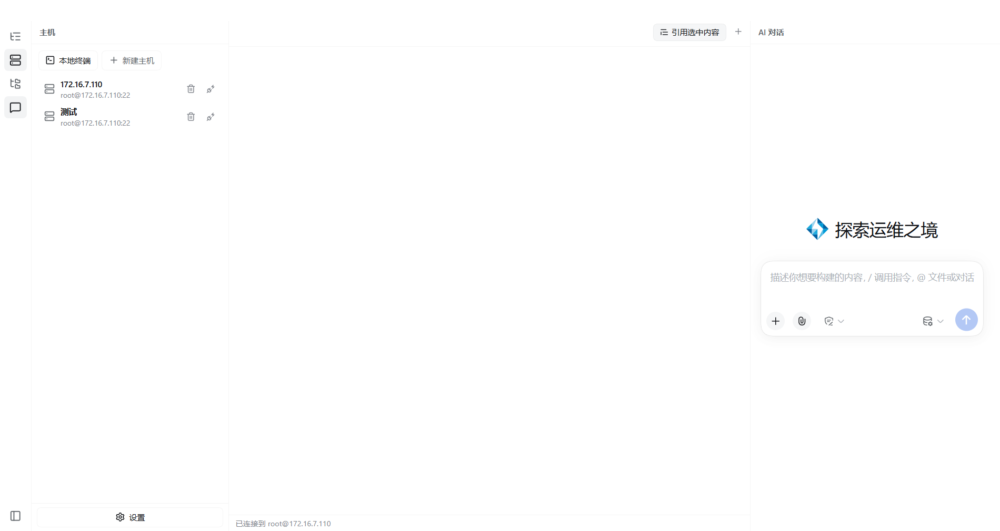 |
| Add a host (password or key) | A remote terminal, ready on connect |
| 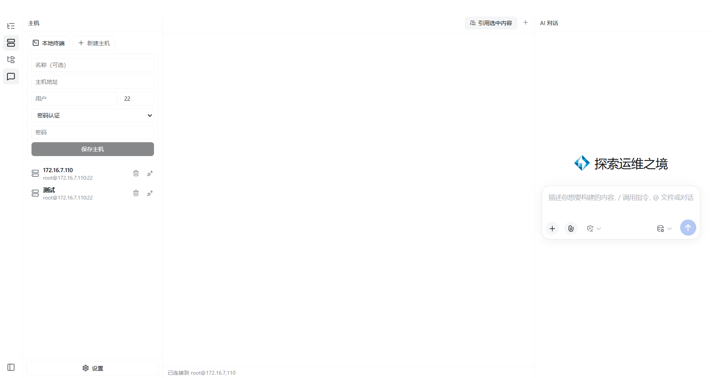 | 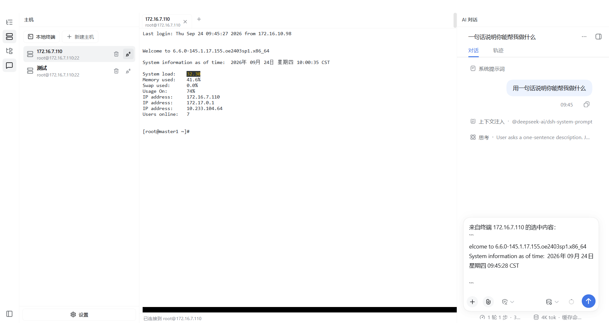 |

### Terminal work and AI collaboration

| Run commands in the terminal | Select live output |
| --- | --- |
| 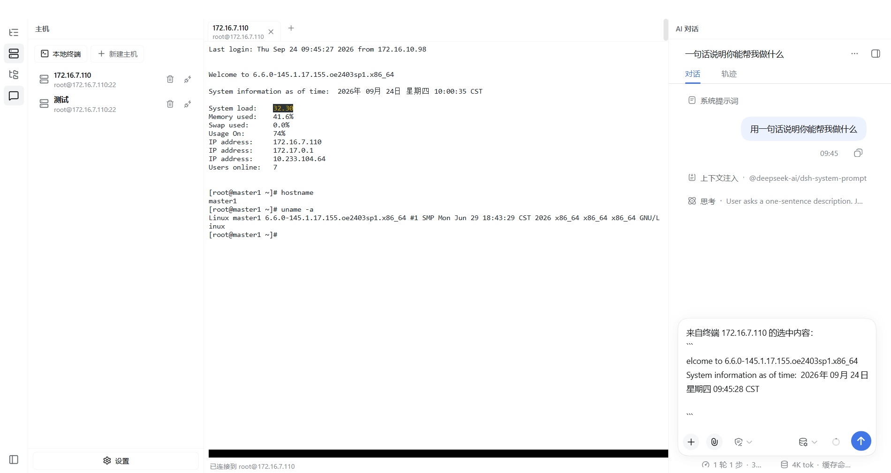 | 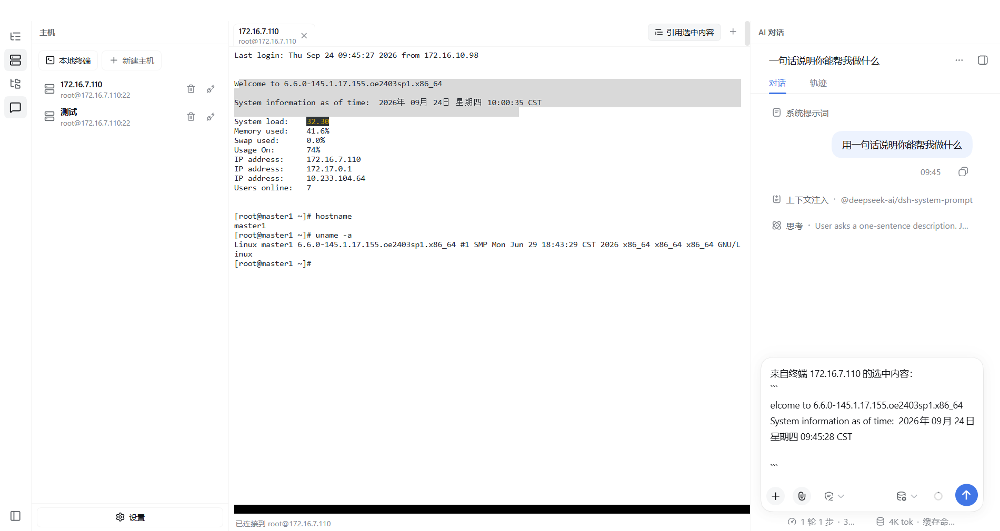 |
| Quote it into the chat | AI conversation |
|  | 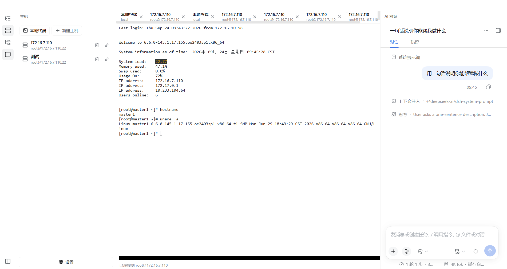 |

### AI answers and plan mode

| Answer settled (thinking expandable) | Type `/plan` to enter plan mode |
| --- | --- |
|  | 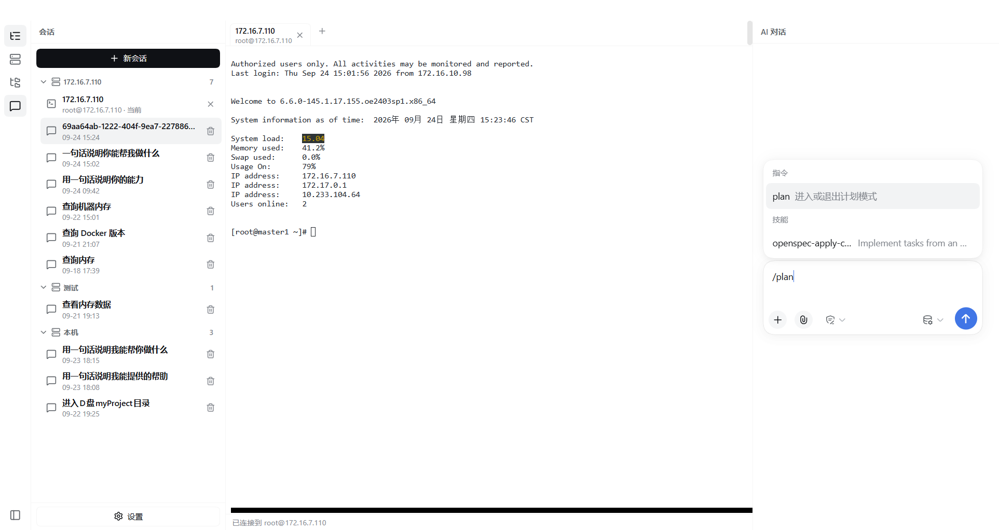 |
| Plan mode active | A proposed command card |
| 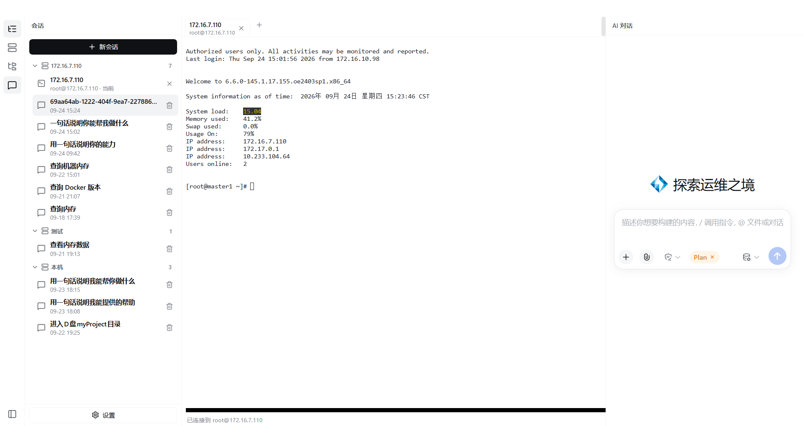 |  |
| Click Run; the command lands in the terminal | |
| 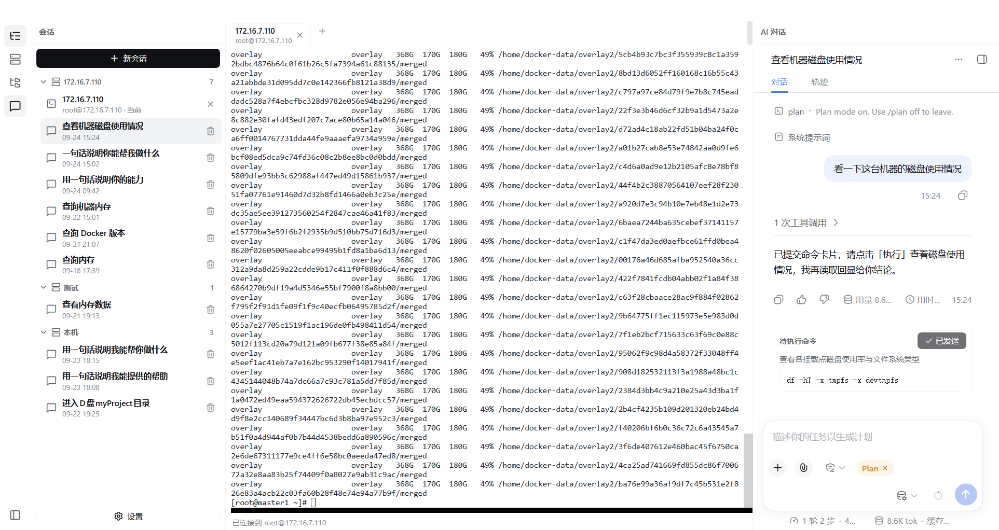 | |

### Files, sessions, and settings

| File panel (follows the connected host) | Sessions grouped by host |
| --- | --- |
| 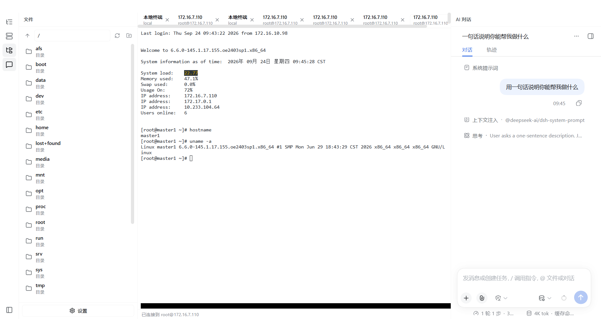 |  |
| General settings | Model settings |
| 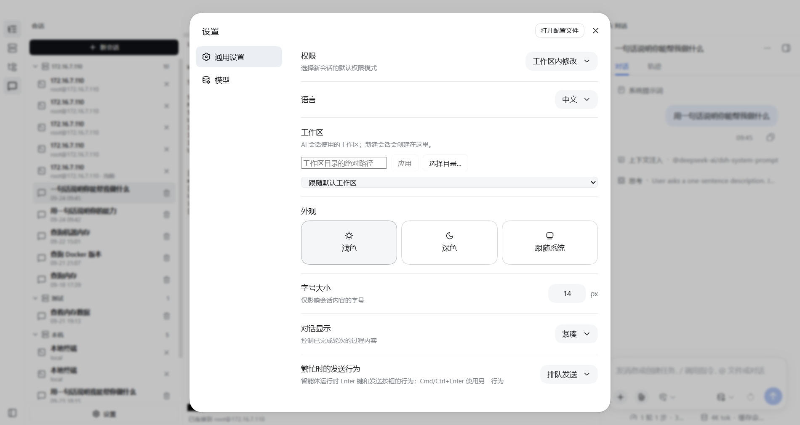 | 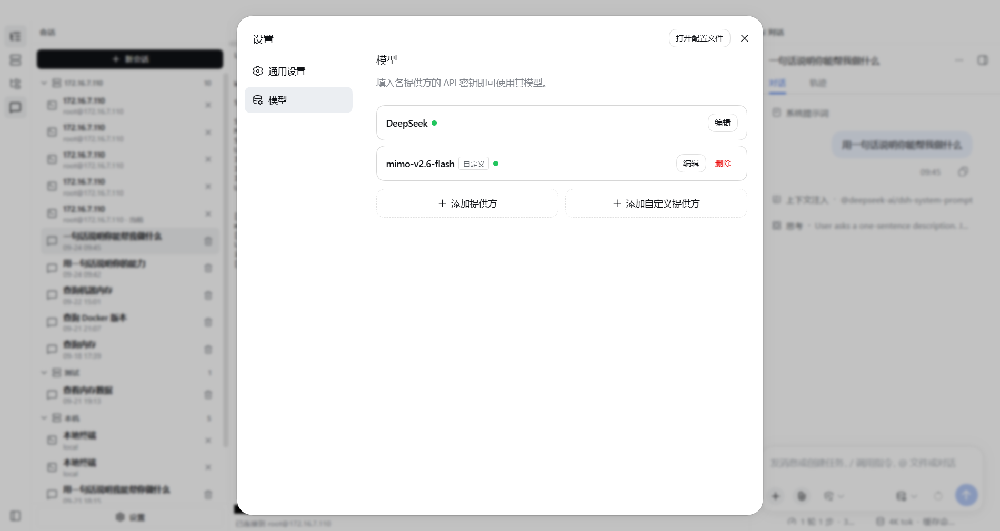 |
| Dark theme · overview | Light theme · overview |
| 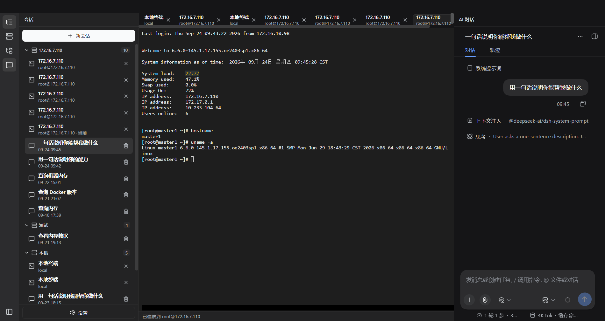 | 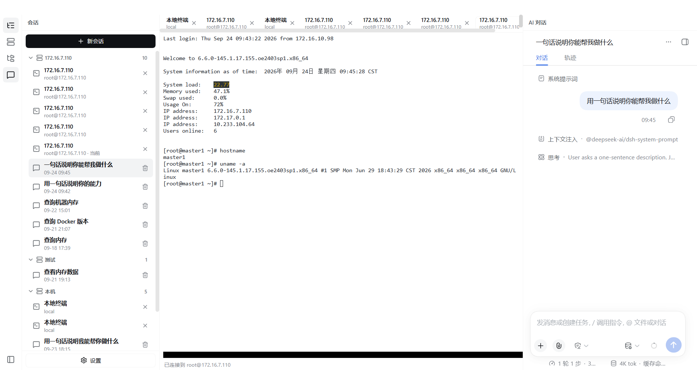 |

### Theme details and safe deletion

| Dark theme · settings | Dark theme · terminal |
| --- | --- |
| 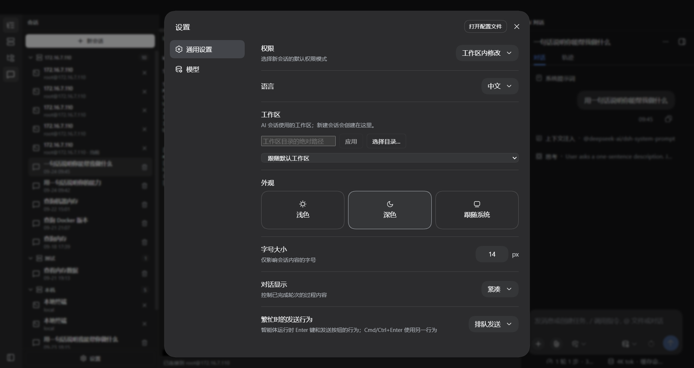 |  |
| Delete a session · inline confirm | Delete a host · inline confirm |
|  | 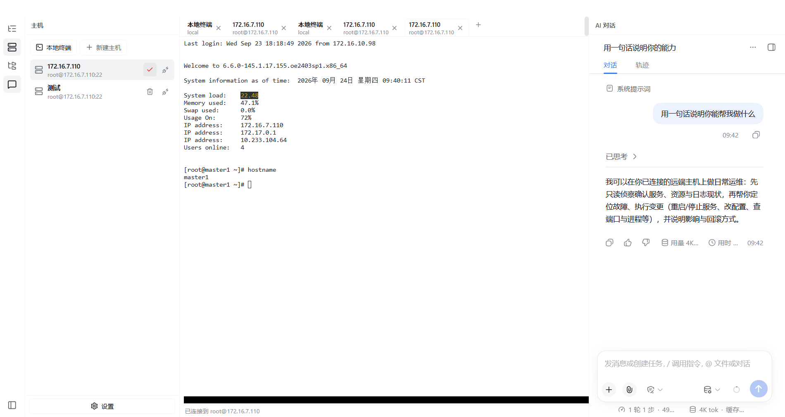 |

All 24 screenshots, per-shot narration, and a storyboard live in [`docs/screenshots/README.md`](docs/screenshots/README.md).

## Highlights

- **The terminal is the context**: select live output in a terminal and quote it into the conversation; the AI reads the real echo instead of a second-hand copy.
- **One terminal, one session**: every terminal tab owns its own AI conversation — switching terminals switches the chat, and each session stays bound to exactly its own terminal.
- **Humans gate the risky work**: in `/plan` mode the AI only submits command cards; clicking "Run" pastes them into the terminal.
- **The AI cannot touch this machine**: a session can only act through the terminals you opened; local shells and local files are out of its reach.

## Features

- **AI-Shell layout**: activity rail, navigation column (sessions / hosts / files), central terminal workbench, and the AI conversation column in one window
- **Remote hosts**: save, edit, and two-step-delete SSH hosts; an SFTP panel that browses, previews, creates directories, and **uploads local files**
- **Terminal workbench**: parallel tabs; the same experience for local and remote shells; quote selections into the chat
- **Session management**: sessions grouped by host, with **full-text search over titles and content**, and two-step inline delete
- **Plan mode**: type `/plan`; commands arrive as cards and run only when a human clicks
- **Appearance**: light / dark / system, with a terminal that stays readable in dark mode
- **Desktop surfaces**: system tray (profile switch, diagnostics export) and startup recovery
- **Packaging**: Windows NSIS installer and portable zip; the macOS packaging flow is included

## Download

Windows x64 builds are published on [GitHub Releases](https://github.com/Alexliwenhao/shell-desktop/releases/latest):

| Artifact | Notes |
| --- | --- |
| `AI-Shell-Desktop-<version>-x64-Setup.exe` | NSIS installer; builds are currently unsigned, so Windows may warn about an unknown publisher on first run |
| `AI-Shell-Desktop-<version>-x64-Portable.zip` | Portable archive; extract it and run `AI Shell Desktop.exe` inside |

## Build from source

Requires Node.js 22.19+ or 24+, with Yarn 4 through Corepack:

```sh
git submodule update --init --recursive
corepack yarn install --immutable
corepack yarn dev            # develop
corepack yarn check          # build, typecheck, tests
corepack yarn dist:win       # Windows installer (run on Windows)
```

## Documentation

| Goal | Entry point |
| --- | --- |
| Install and daily use | [User guide](docs/user-guide.en.md) |
| Platform, environment, and boundaries | [FAQ](docs/faq.en.md) |
| Desktop host architecture and release boundary | [Architecture](docs/architecture.en.md) |
| Writing plugins / desktop plugin contract | [Plugin development](docs/plugin-development.en.md) · [Desktop services](shell-desktop/docs/plugin-services.md) |
| Data processing and privacy choices | [Privacy policy](PRIVACY.md) |
| Contributing | [CONTRIBUTING.en.md](CONTRIBUTING.en.md) |

## Relationship to DeepSeek Harness

Upstream provides the agent capabilities, plugin system, and Web UI; this project owns the desktop packaging: application shell, local service lifecycle, windows and tray, and installer builds. The pinned `deepseek-harness/` submodule runs unmodified, and the desktop shell joins the same runtime through the DSH plugin mechanism.

## License

[MIT](LICENSE). “DeepSeek Harness” is a registered trademark of DeepSeek; this project uses the name only to describe its technical origin and compatibility.
