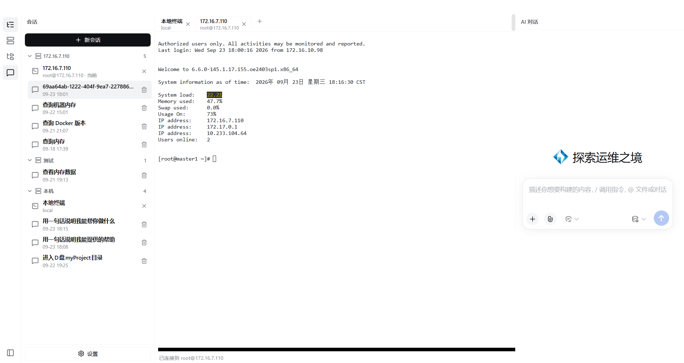
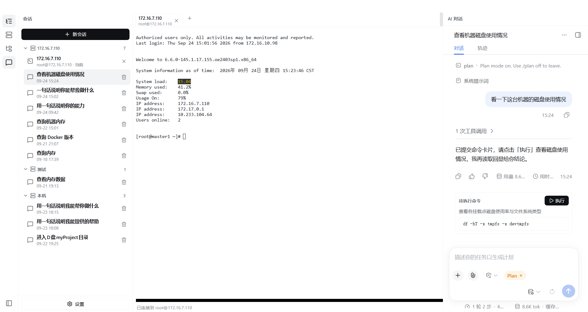
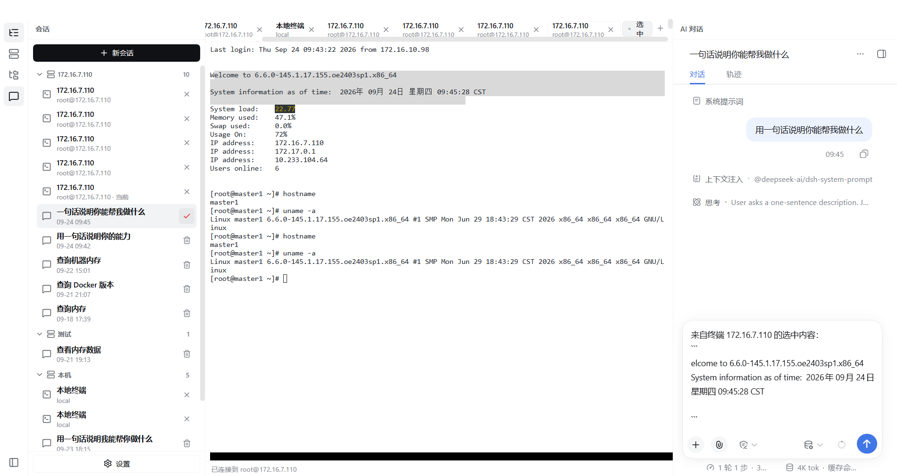
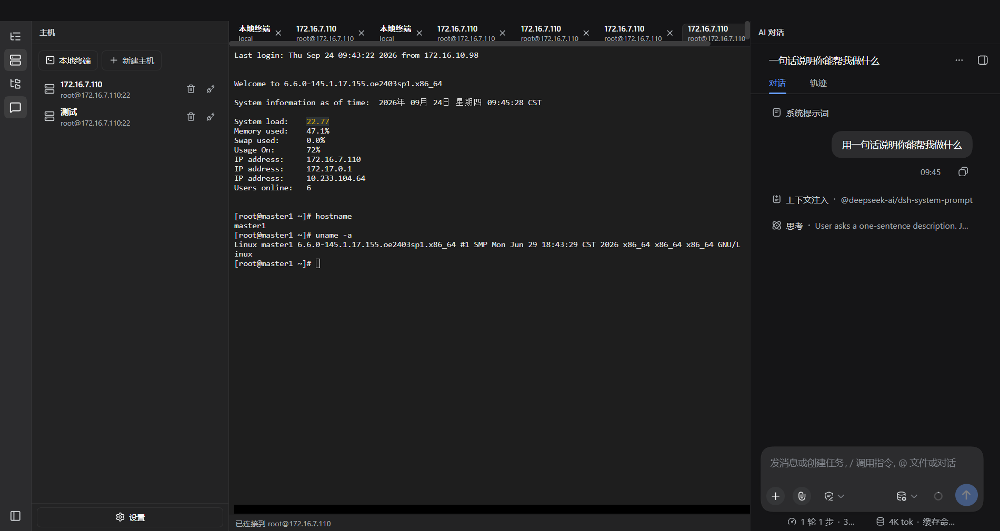

# AI Shell Desktop

基于 [DeepSeek Harness](https://github.com/deepseek-ai/deepseek-harness) 的 Windows / macOS 桌面客户端：把终端、文件与 AI 对话放进同一个窗口，AI 只在你打开的真实终端里干活。

> 独立的开源项目，与深度求索不存在隶属、合作、授权或背书关系。

## 界面预览

| 一屏三栏 | 计划模式：命令由你点「执行」 |
| --- | --- |
|  |  |
| 选中终端输出，一键引用进对话 | 深色主题下终端依旧清晰 |
|  |  |

全部 24 张功能截图、逐张讲解与视频分镜见 [`docs/screenshots/`](docs/screenshots/README.md)。

## 亮点

- **终端即上下文**：在终端里选中现场输出，一键「引用选中内容」进对话；AI 读的是真实回显，不是复制粘贴的第二手材料。
- **一终端一会话，互不串台**：每个终端标签绑定自己的 AI 会话，切换终端即切换对话；会话与其终端严格一一对应，AI 只能操作它绑定的那台终端。
- **高危动作由人把关**：`/plan` 计划模式下 AI 只提交「待执行命令」卡片，你点「执行」才会进入终端。
- **AI 碰不到本机**：会话只能通过你打开的终端操作远端机器；本机 shell 与本机文件不在它的能力范围内。

## 功能

- **AI Shell 布局**：活动栏、导航列（会话 / 主机 / 文件）、中央终端工作台、右侧 AI 对话同屏协同
- **远端主机**：SSH 主机保存 / 编辑 / 二次确认删除；SFTP 文件面板支持浏览、预览、新建目录与**上传本地文件**
- **终端工作台**：多标签并行；本地 shell 与远端 Linux shell 体验一致；选中内容可引用进对话
- **会话管理**：会话按主机归组，支持**标题与内容全文检索**，删除行内二次确认
- **计划模式**：输入 `/plan` 进入，命令逐条以卡片提交、由人点击执行
- **外观**：浅色 / 深色 / 跟随系统；深色下终端保持清晰可读
- **桌面能力**：系统托盘（Profile 切换 / 诊断导出）、启动恢复
- **打包**：Windows NSIS 安装包与免安装 zip；macOS 打包流程已内置

## 下载

Windows x64 构建发布在 [GitHub Releases](https://github.com/Alexliwenhao/shell-desktop/releases/latest)：

| 产物 | 说明 |
| --- | --- |
| `AI-Shell-Desktop-<版本>-x64-Setup.exe` | NSIS 安装包；当前未签名，首次运行可能提示「未知发布者」 |
| `AI-Shell-Desktop-<版本>-x64-Portable.zip` | 免安装包；解压后运行目录内的 `AI Shell Desktop.exe` |

## 从源码构建

需要 Node.js 22.19+ 或 24+，以及 Corepack 提供的 Yarn 4：

```sh
git submodule update --init --recursive
corepack yarn install --immutable
corepack yarn dev            # 开发启动
corepack yarn check          # 构建 / 类型检查 / 测试
corepack yarn dist:win       # Windows 安装包（需在 Windows 上执行）
```

## 文档

| 目标 | 入口 |
| --- | --- |
| 安装与日常使用 | [用户指南](docs/user-guide.md) |
| 平台、环境与使用边界 | [常见问题](docs/faq.md) |
| 桌面宿主架构与发布边界 | [架构说明](docs/architecture.md) |
| 编写插件 / 桌面插件接口 | [插件开发](docs/plugin-development.md) · [桌面服务合同](shell-desktop/docs/plugin-services.zh.md) |
| 数据处理与隐私选择 | [隐私政策](PRIVACY.zh.md) |
| 参与贡献 | [CONTRIBUTING.md](CONTRIBUTING.md) |

## 与 DeepSeek Harness 的关系

上游提供智能体能力、插件系统与 Web UI；本项目负责桌面封装：应用外壳、本地服务的启动与恢复、窗口与托盘、安装包构建与发布。固定版本的 `deepseek-harness/` 子模块原样运行，桌面壳通过 DSH 的插件机制组合进同一运行时。

## License

[MIT](LICENSE)。「DeepSeek Harness」是深度求索公司的注册商标，本项目仅为说明技术来源与兼容性而使用该名称。
